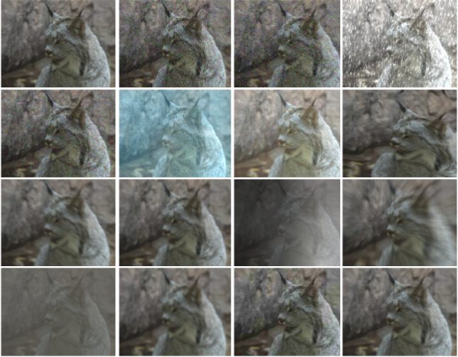

# How robust are discriminatively trained zero-shot learning models?

This repository contains the PyTorch implementation of our paper [How robust are discriminatively trained zero-shot learning models?](https://arxiv.org/pdf/2201.10972.pdf) published at [Elsevier Image and Vision Computing](https://www.sciencedirect.com/journal/image-and-vision-computing).


## Paper Highlights
In this paper, as a continuation of our previous [work](https://arxiv.org/pdf/2008.07651.pdf), we focus on the corruption robustness of discriminative ZSL models. Highlights of our paper is as follows.

1. In order to facilitate the corruption robustness analyses, we curate and release the first benchmark datasets CUB-C, SUN-C and AWA2-C.
2. We show that, compared to fully supervised settings, class imbalance and model strength are severe issues effecting the robustness behaviour of ZSL models.
3. Combined with our previous [work](https://arxiv.org/pdf/2008.07651.pdf), we define and show the _pseudo robustness_ effect, where absolute metrics may not always reflect the robustness behaviour of a model. This effect is present for adversarial examples, but not for corruptions.
4. We show that recent augmentation methods designed for better corruption robustness can also increase the clean accuracy of ZSL models, and set new strong baselines.
5. We show in detail that unseen and seen classes are affected disproportionately. We also show zero-shot and generalized zero-shot performances are affected differently.

## Dataset Highlights

We release CUB-C, SUN-C and AWA2-C, which are corrupted versions of three popular ZSL benchmarks. Based on the previous [work](https://arxiv.org/abs/1903.12261), we introduce several corruptions
in various severities to test the generalization ability of ZSL models. More details on the design process and corruptions can be found in the paper.




## Repository Contents and Requirements
This repository contains the code to reproduce our results and the necessary scripts to generate
the corruption datasets. You should follow the below steps before running the code.

* You can use the provided environment yml (or pip requirements.txt) file to install dependencies. 
* Download the pretrained models [here](https://drive.google.com/file/d/1MV0jIZm_LfJYFy-ekQgztISfMSRLkiYI/view?usp=sharing) and place them under `/model` folders.
* Download [AWA2](https://cvml.ist.ac.at/AwA2/), [SUN](http://cs.brown.edu/~gmpatter/sunattributes.html) and [CUB](http://www.vision.caltech.edu/visipedia/CUB-200-2011.html) 
datasets. Please note we operate on raw images, not the features provided with the datasets. 
* Download the data split/attribute files [here](https://drive.google.com/file/d/1jk2wWtXavjizjvRFTt4OKBMyHKZBPm9v/view?usp=sharing) and extract the contents into `/data` folder. 
* Change the necessary paths in the json file.

:exclamation: The code in this repository lets you evaluate our provided models with AWA2, CUB-C and SUN-C. If you want to use corruption datasets, you can take `generate_corruption.py` file and use it in your own project. 

##  :exclamation: Additional Content  :exclamation:

**In addition to the paper, we release our supplementary file `supp.pdf`. It includes the following**.

**1. Average errors (ZSL and GZSL) for each dataset per corruption category.** These are for the ALE model, and should be used to weight the errors when calculating mean corruption errors. For comparison, this essentially replaces AlexNet error weighting used for ImageNet-C dataset.

**2. Mean corruption errors (ZSL and GZSL) of the ALE model, for seen/unseen/harmonic and ZSL top-1 accuracies, on each dataset.** These results include the MCE values for original ALE and ALE with five defense methods used in our paper (i.e. total-variance minimization, spatial smoothing, label smoothing, AugMix and ANT). These values can be used as baseline scores when comparing the robustness of your method.


## Running the code
After you've downloaded the necessary dataset files, you can run the code by simply

```bash
python run.py
```

For changing the experimental parameters, refer to params.json file. Details on json file parameters can be found in the code. By default, running `run.py` looks for a `params.json` file in the folder. If you want to run the code with another json file, use

```bash
python run.py --json_path path_to_json
```

## Citation
If you find our code or paper useful in your research, please consider citing the following papers.

```
@inproceedings{yucel2020eccvw,
  title={A Deep Dive into Adversarial Robustness in Zero-Shot Learning},
  author={Yucel, Mehmet Kerim and Cinbis, Ramazan Gokberk and Duygulu, Pinar},
  booktitle = {ECCV Workshop on Adversarial Robustness in the Real World}
  pages={3--21},
  year={2020},
  organization={Springer}
}

@article{yucel2022imavis,
title = {How robust are discriminatively trained zero-shot learning models?},
journal = {Image and Vision Computing},
pages = {104392},
year = {2022},
issn = {0262-8856},
doi = {https://doi.org/10.1016/j.imavis.2022.104392},
url = {https://www.sciencedirect.com/science/article/pii/S026288562200021X},
author = {Mehmet Kerim Yucel and Ramazan Gokberk Cinbis and Pinar Duygulu},
keywords = {Zero-shot learning, Robust generalization, Adversarial robustness},
}

```
## Acknowledgements
This code base has borrowed several implementations from [here](https://github.com/cetinsamet/attribute-label-embedding-old), [here](https://github.com/hendrycks/robustness) and it is a continuation of our previous work's [repository](https://github.com/MKYucel/adversarial_robustness_zsl). 

